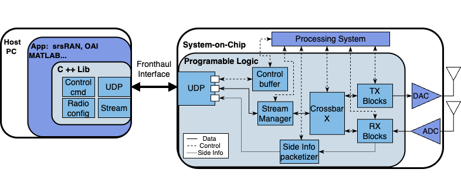
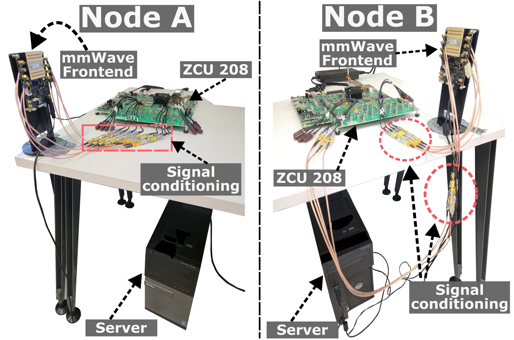

# HELIX: High-Speed Real-Time Experimentation Platform for 6G Wireless Networks - Artifacts

This repository contains the artifacts for the paper "HELIX: High-speed Real-Time Experimentation
Platform for 6G Wireless Networks" submitted at Mobisys '25.  These artifacts include the C++ library, Vivado project for the FPGA design, and the baremetal C code for the ARM processor on the RFSoC.  This allows researchers to reproduce our results and further explore advanced wireless technologies using HELIX.


## Introduction

HELIX is a 6G-ready experimentation platform designed for high-speed, real-time wireless research. It combines a comprehensive physical layer subsystem implemented in hardware (FPGA) with a flexible software control interface (C++ library) for seamless integration with host applications and O-RAN systems. This repository provides the necessary code and instructions to get started with HELIX. It allows you to reconfigure functional splits on the fly, experiment with different numerologies, and access side-information crucial for ISAC applications.



## Repository Content
This repository contains the following:
- C++ library that serves as a connection between the implementation on the RFSoC and the network applications. (`lib/` and `include/`). The code documentation is at the header files.
- Vivado project that contains the FPGA implementation of the PHY 5G blocks and UDP stack. (`fpga/`)
- Baremetal application source code running on the RFSoC's ARM processor. (`arm_baremetal_app/`)
- Binary file containing the RFSoC HELIX implementation for the ZCU208. (`sdsimage/`)
- Example scripts to reproduce some experiments from the paper. (`examples/`)
- Generated samples and decoder functions in MATLAB to validate the different splits. (`matlab/`)

## Open Source License

HELIX is publicly offered under the GNU General Public License version 3 (GPLv3). If you use the GPLv3-licensed version of HELIX in your application, your application must then also be licensed under the GPLv3.


## Equipment List

*   **RFSoC Development Board:**
    *   Xilinx ZCU208
*   **Host PC:**
    *   A Linux-based PC (Ubuntu 22.04 or later recommended).
    *   10 GbE network interface.
*   **RF Front Ends (Depending on band):**
    *   Sub-6 GHz Transceivers 
    *   mmWave Front Ends (e.g., Sivers 28 GHz or 60 GHz EVK - [Links to Sivers Products](https://www.sivers-semiconductors.com/5g-millimeter-wave-mmwave-and-satcom/)).
*   **Cables & Connectors:**
    *   SMA cables
    *   Signal conditioning (Filters, DC blocks, Attenuators)
*   **(Optional) Oscilloscope/Spectrum Analyzer:** For signal analysis and verification.

## Hardware Setup

1.  **RFSoC Connection:**
    - Connect the RFSoC board to the host PC via Ethernet cable (10 Gbps port).
      - Set jumper J32 ON to enable SPF+ 10GbE port number 2
        and use this one - looking at the J29 front opening, connector at the right top corner.
    *   Load the BOOT.bin file into an SD card and set the RFSoC to [SD boot mode](https://xilinx-wiki.atlassian.net/wiki/spaces/A/pages/569017820/RF+DC+Evaluation+Tool+for+ZCU208+board+-+Quick+Start#Jumpers-and-Switch-Settings).
    *   Power on the RFSoC board.
2.  **RF Front End Connections:**
    *   Connect the RF front ends to the appropriate RFSoC AD/DA converter ports using SMA cables. 
    * For this implementation the AD/DA mapping port is the following:
      * DAC -> tile228: channel 0 for I and channel 1 for Q.
      * ADC -> tile226: channel 0 for I and channel 1 for Q.
    * Refer to ZCU208 documentation for physical locations. Take into account that ZCU208 has differential outputs.





## Software Setup - C++ Library

### Recommended dependencies

*   **Operating System:** Ubuntu 22.04.
*   **Compiler:** g++ (version >= 11.0)
*   **CMake:** (version >= 3.0)
*   **Make:** (version >= GNU Make 4.3)
*   **Matlab(optional)**: version 2022b

```bash
sudo apt update
sudo apt install g++ cmake make libboost-dev
```

### Performance tuning

- Set your CPU governor to `performance`. This can be done using `cpufrequtils`.

```bash
   sudo apt install cpufrequtils
   for ((i=0;i<$(nproc --all);i++)); do sudo cpufreq-set -c $i -r -g performance; done
```
- Adjust network buffers.
```bash
sudo sysctl -w net.core.wmem_max=33554432
sudo sysctl -w net.core.rmem_max=33554432
sudo sysctl -w net.core.wmem_default=33554432
sudo sysctl -w net.core.rmem_default=33554432
```
- Set the Ethernet of your MTU to 9000
```bash
sudo ifconfig <interface> mtu 9000
```

### Building the C++ Library and Examples (CMake)

Although Helix can be build and executed using bash commands, it is suggested to use a C++ ide (VisualStudio, Clion) to speed up the deployment.

1. Clone the repository:
```bash
git clone 
```
2. Create a Build Directory:
```bash
mkdir build
cd build
```
3. Configure the project with CMake:
```bash
cmake ..
```
4. Build the Library and Examples:
```bash
make
```
This will build the library and all example executables in the `build/` directory.

## Running the Examples

Important: Before running any example, ensure the RFSoC is programmed using the `BOOT.bin` file. The IP of the testbed is `192.168.5.128` by default, but it can be configured (TBD). Some 

Each example demonstrates a different aspect of HELIX's capabilities. They are located in the `examples/ directory. Here's a detailed breakdown:

- `loopback`: This example demonstrates basic transmit and receive functionality using different splits. It sets up a simple communication test using just one HELIX node.
  - Usage: `.build/loopback_test` 
  - Description: One node transmitter and receiver is connected in loopback. Run the code to store the samples and analyze them later.
- `latency`: This example is an experiment in which the end-to-end latency from two HELIX nodes is measured.  
    - Usage:
      - Node A `.build/latency_node_a`
      - Node B `.build/latency_node_b`
    - Description: To run this experiment, first initialize the Node B, which will be waiting for an initial message from Node A. The first message from Node A will start the experiment. 
- `throughput`: This example is a throughput experiment through different functional splits. 
    - Usage:
      - Transmitter `.build/throughput_experiments_tx`
      - Receiver `.build/throughput_experiments_rx`
    - Description: In this case one node is constantly transmitting slots while the other is receiving data. The receiver will show the results in the console. To change the split configurations please check the code.
- `hw accel`: This examples demonstrates how HELIX can be used in the context of Abstracted Acceleration Layer (AAL). In this example the FPGA offloads the OFDM demodulation function.
    - Usage: `.build/hw_accel_exp`
    - Description: For this experiment only one node is needed. The script uses IQ samples of 5G downlink slot from a txt file and feeds them to the OFDM demodulator which performs the FFT and sends back the samples in frequency domain. This same operation is run X number of times. The mean latency and throughput is shown in the console.

## Matlab decoder

This repository includes decoder functions to validate the receiving data together with a set of example slots to transmit in .txt format.

The `CONFIG_5G_DECODER.m()` sets the configuration parameter of the transmitted data. Every functional splitting will have its own decoder.

## (Optional) How to generate the vivado project

Requisites: 
- Vivado 2022.2

Generate the project by changing the directory in Vivado to the `fpga/` folder and execute the tcl file `HELIX.tcl`

```bash
cd path-to-folder/fpga
source path-to-folder/fpga/HELIX.tcl
```

The script will automatically generate the block design. The 5G PHY processing blocks are all contained at `fpga/IP_REPO`.